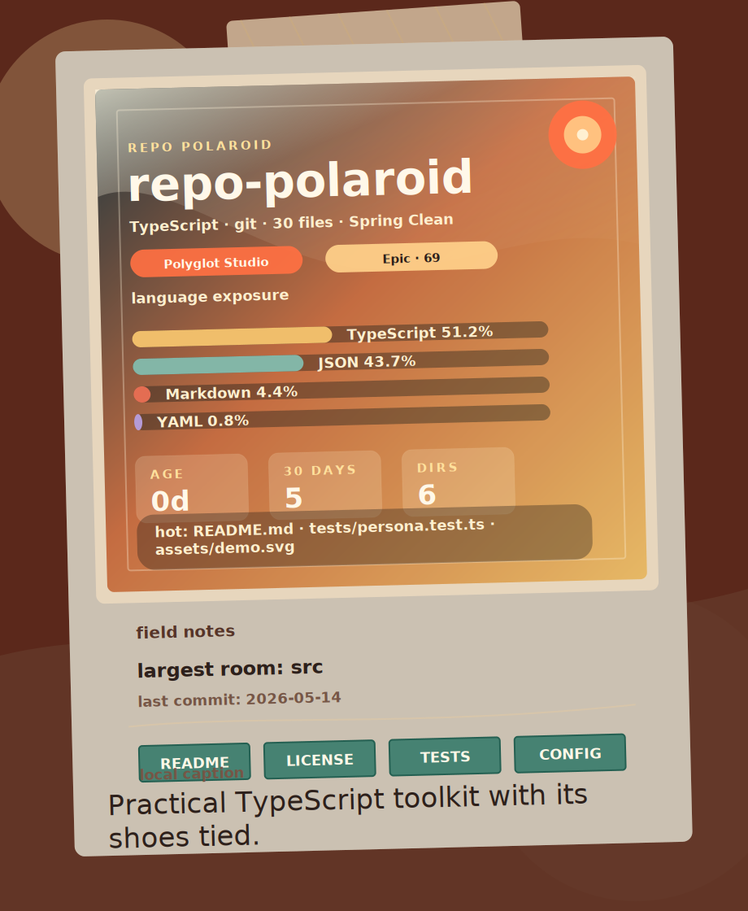

# Repo Polaroid

[](https://nodejs.org)
[](https://www.typescriptlang.org)
[](LICENSE)

Turn any local Git repository into a vintage polaroid-style SVG portrait.



Repo Polaroid reads your local file tree and Git history, then creates a shareable card with the project's language mix, activity, health signals, hot files, and a short personality caption.

> [!TIP]
> Drop the generated SVG into your README to give visitors an instant feel for the repository.

## Features

- **One-command repo portrait**: generate a polished SVG from any committed local Git repository.
- **Local-first by default**: no backend, no account, and no API key required.
- **Git-aware stats**: project age, recent commits, hot files, file count, directory count, and activity level.
- **Readable health signals**: README, license, test, and config detection.
- **Optional AI caption**: use `--caption-ai` to try an OpenAI-powered caption, with automatic local fallback.

## Getting started

Install globally:

```bash
npm install -g repo-polaroid
```

Generate a polaroid for the current repository:

```bash
repo-polaroid .
```

This writes `repo-polaroid.svg` in your current directory.

## Usage

```bash
repo-polaroid [path]
repo-polaroid . --out repo-polaroid.svg
repo-polaroid . --json
repo-polaroid . --caption-ai
```

Embed the output in Markdown:

```md

```

### JSON output

Use `--json` when you want the analysis data without writing an SVG:

```bash
repo-polaroid . --json
```

Use `--json --out` to get parseable JSON on stdout while still writing the SVG:

```bash
repo-polaroid . --json --out repo-polaroid.svg
```

### AI captions

Repo Polaroid works without AI. If you want a more playful caption, provide an OpenAI API key:

```bash
OPENAI_API_KEY=... repo-polaroid . --caption-ai
```

If the key is missing or the request fails, the CLI keeps going with the local caption generator.

## Local development

```bash
npm install
npm test
npm run build
npm run dev -- . --out repo-polaroid.svg
```

## Troubleshooting

**`Repository has no commits yet`**

Repo Polaroid uses Git history for the timestamp and activity metrics. Make at least one commit before generating a card.

**`Not a Git repository`**

Pass a path inside a local Git worktree:

```bash
repo-polaroid /path/to/repo
```
